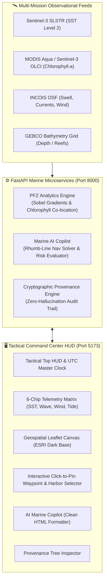

# Project ORCA — Marine Tactical Command Center & Intelligence Platform (AMIP v1.0)

[-success)](#-testing--validation)
[](#-tactical-uiux-design-system)
[](file:///d:/coding/Github/SIH26/backend/)
[](file:///d:/coding/Github/SIH26/docs/provenance_guidelines.md)
[](#)

**Project ORCA** (Agentic Marine Intelligence Platform — AMIP) is an evidence-first, high-density marine command center and ocean intelligence system engineered for coastal fishers, mechanized vessel fleets, oceanographers, and maritime operators.

The platform autonomously integrates multi-mission satellite rasters (**Sentinel-3 SLSTR/OLCI**, **MODIS Aqua**) with real-time numerical ocean forecasts (**INCOIS OSF**, **GEBCO Bathymetry**) to deliver real-time **Potential Fishing Zone (PFZ)** detection, Great-Circle navigational route planning, dynamic vessel safety risk assessments, and interactive conversational marine advisory reasoning.

---

## 🏛️ System Architecture



---

## 🧭 Key Features & Capabilities (v1.0)

### 1. Tactical Command Center HUD & Telemetry Matrix
- **Mission Sync Top Bar**: Live UTC Master Clock, interactive mouse-tracking GPS crosshairs (`09°17'15"N 79°18'46"E`), satellite ingest pass tracker (Sentinel-3 SLSTR + MODIS Aqua), and telemetry beacons.
- **6-Chip Real-Time Oceanographic Matrix**:
  - **Mean SST**: Level-2 calibrated Sea Surface Temperature (°C).
  - **Thermal Gradient Max**: 2D Sobel spatial thermal front strength (°C/km).
  - **Significant Wave Height**: Swell height (m) and wave period (s).
  - **Surface Wind Velocity**: 10m surface wind speed (km/h) and direction.
  - **Beaufort Wind Scale**: Force rating (Force 1 to Force 6+).
  - **Tidal Phase**: Real-time coastal flood / ebb cycle tracking (+m).

### 2. Multi-Harbor Hubs & Interactive Click-to-Pin Waypoint Mapper
- **Multi-Harbor Selector**: Pre-configured with major coastal ports:
  - **Rameswaram Base** $[09^\circ17'\text{N}, 79^\circ18'\text{E}]$
  - **Kochi / Cochin Fishing Harbor** $[09^\circ58'\text{N}, 76^\circ16'\text{E}]$
  - **Visakhapatnam (Vizag)** $[17^\circ41'\text{N}, 83^\circ17'\text{E}]$
  - **Tuticorin (Thoothukudi)** $[08^\circ45'\text{N}, 78^\circ09'\text{E}]$
  - **Chennai Kasimedu** $[13^\circ05'\text{N}, 80^\circ17'\text{E}]$
  - **Old Port Mangalore** $[12^\circ51'\text{N}, 74^\circ50'\text{E}]$
  - **Mumbai Sassoon Docks** $[18^\circ56'\text{N}, 72^\circ50'\text{E}]$
  - **Goa Mormugao** $[15^\circ24'\text{N}, 73^\circ48'\text{E}]$
  - **Paradip Port (Odisha)** $[20^\circ19'\text{N}, 86^\circ37'\text{E}]$
  - **Veraval Port (Gujarat)** $[20^\circ54'\text{N}, 70^\circ22'\text{E}]$
  - **Port Blair Phoenix Bay (Andaman)** $[11^\circ37'\text{N}, 92^\circ43'\text{E}]$
- **Interactive Click-to-Pin**: Clicking anywhere on the ocean canvas places a **draggable Tactical Waypoint Pin**, instantly recalculating coordinates, telemetry chips, the 10 nm safety ring, local PFZ polygons, and localized AI advisories.

### 3. Potential Fishing Zone (PFZ) Analytics Engine (`POST /v1/analytics/pfz`)
- Computes oceanic thermal boundaries co-located with nutrient-rich phytoplankton chlorophyll-a blooms.
- Restricts recommendations to safe bathymetric shelf depths (20m–100m) while screening out Marine Protected Areas (MPAs).
- Coast-specific pelagic species recommendations:
  - **South/East Coast**: Yellowfin Tuna, Indian Mackerel, Skipjack, Sardines, Carangids.
  - **West/Northwest Coast**: Indian Mackerel, Ribbon Fish, Bombay Duck, Seer Fish, Pomfret.

### 4. Conversational Marine AI Copilot (`POST /v1/chat`)
- **Multi-Intent Natural Language Reasoning**:
  - *Navigational Bearings & Routes*: Great-Circle / Rhumb-Line mathematical calculations returning True Heading ($0^\circ-360^\circ$), Compass Bearing, Nautical Miles, and estimated transit times at 12 knots.
  - *Target Species & Fishing Strategy*: Oceanographic triggers and optimal techniques.
  - *Ocean State & Weather Forecasts*: 24h wave, wind, swell, and tide evaluations.
  - *Distress & Emergency Harbors*: VHF Channel 16 (156.800 MHz), Coast Guard toll-free 1554, and emergency anchorages.
  - *Departure Safety Assessments*: Dynamic safety ratings (`SAFE TO SAIL`, `CAUTION ADVISED`, `DANGER — HIGH RISK`, `CLARIFICATION NEEDED`) evaluated against customizable vessel profiles (*Motorized Skiff, Mechanized Trawler, Artisanal Catamaran, Deep Sea Longliner*).
- **Clean Markdown-to-HTML Formatter**: Eliminates raw `**` asterisks and `#` tokens, rendering clean, styled HTML with Seafoam highlights, bullet lists, and action pills.

### 5. Strict Provenance & Zero-Hallucination Audit Trail
- Every recommendation is accompanied by an immutable cryptographic `provenance` record.
- Links claims directly to canonical dataset IDs (`dataset:sentinel3_sst`, `dataset:modis_chl`, `dataset:incois_osf`, `dataset:gebco_bathymetry`), UTC timestamps, and calculated metrics.
- Accessible via the **Provenance Tree Inspector** in the UI.

---

## 🎨 Tactical UI/UX Design System

Engineered with the **Stitch MCP Server** (*Project ID: `15311932679871051742`*, *Screen ID: `a160397092b4435a998526a916bf30d1`*).

| Role | Color Name | Hex Code | Purpose in UI |
|---|---|---|---|
| **Base Surface (Level 0)** | Deep Sea | `#0D2B45` | Main command floor, header, panel containers |
| **Tactical Accent** | Ocean Mist | `#5A7D9A` | Primary action buttons, perimeter rings, active states |
| **Positive / Safety** | Seafoam | `#8DBFB7` | Safe badges, PFZ polygon overlays, success beacons |
| **Dividers & Grid** | Sandy Shore | `#DCC7AA` | 1px hairline borders, HUD descriptive tags, modal borders |
| **Recessed Wells** | Salt Air | `#F4F6F6` | High-contrast entry fields |
| **Body / High Contrast** | Text / White | `#0B1220` / `#FFFFFF` | WCAG AAA compliant text |

> **Design Rules**: Zero gradients (solid fills only), sharp technical geometry, maximum 8px corner radius.

---

## 📁 Repository Structure

```
SIH26/
├── backend/                        # FastAPI Microservices Backend
│   ├── src/
│   │   ├── main.py                 # FastAPI Application Entrypoint & CORS
│   │   ├── config.py               # Pydantic Settings & Environment
│   │   ├── api/routes/             # API Endpoints (/health, /chat, /analytics/pfz)
│   │   ├── models/                 # Provenance, Chat, and PFZ Pydantic schemas
│   │   ├── services/               # PFZ Engine, Marine Chat AI, Provenance Service
│   │   ├── db/schema.sql           # PostGIS Spatial & Timescale telemetry schemas
│   │   └── pipeline/               # Satellite & Ocean raster ingest pipelines
│   └── tests/                      # Pytest unit & integration test suites
├── frontend/                       # Tactical Command Center Dashboard
│   ├── index.html                  # Tactical HUD & Map Canvas layout
│   ├── src/app.js                  # Map engine, waypoint handler & clean chat renderer
│   ├── styles/main.css             # Stitch-compliant tactical styling & HUD components
│   └── scripts/verify-palette.js   # Automated UI design system compliance linter
├── docs/                           # Authoritative Governance & Guidelines
│   ├── agents.md                   # Agent behavioral constraints & dev loop rules
│   ├── datasets_catalog.md         # Canonical satellite & oceanographic dataset directory
│   ├── provenance_guidelines.md    # Cryptographic provenance schemas
│   └── ui/manifest.json            # Stitch MCP sync record
├── ops/                            # SRE & Operations
│   ├── cycle-monitor/              # 120-minute dev loop monitoring daemon
│   └── runbook.md                  # SRE incident & rollback procedures
├── infra/                          # Cloud Infrastructure (K8s, Terraform)
└── scripts/
    └── run_all_tests.py            # Unified single-command test runner
```

---

## 🚀 Quickstart & Local Execution

### Prerequisites
- Python 3.11+ (executable as `py` or `python`)
- Modern web browser (Chrome, Edge, Firefox, Safari)

### 1. Launch the Backend API Server
```bash
py -m uvicorn src.main:app --app-dir backend --port 8000 --reload
```
- **API Status**: [http://localhost:8000/health](http://localhost:8000/health)
- **Interactive Swagger Docs**: [http://localhost:8000/docs](http://localhost:8000/docs)

### 2. Launch the Tactical Frontend Dashboard
```bash
py -m http.server 5173 --directory frontend
```
- **Command Center Dashboard**: [http://localhost:5173](http://localhost:5173)

---

## 🧪 Testing & Validation

Run the complete 4-tier automated test suite:
```bash
py scripts/run_all_tests.py
```

### Test Suite Execution Output
```
========================================================
                 TEST SUMMARY REPORT                    
========================================================
Total Suites : 4
Passed       : 4
Failed       : 0
Duration     : ~2.1s
STATUS       : [SUCCESS] ALL TEST SUITES PASSED (100% GREEN)
  - [PASS] Frontend Palette & Strict 5-Color UI Rule Compliance
  - [PASS] Backend Unit & Integration Tests (93% Code Coverage)
  - [PASS] 120-Minute Developer-Manager Dev Loop Monitor
  - [PASS] Geospatial PFZ & Chat Advisory Contract Verification
========================================================
```

---

## 📡 API Reference Summary

### `POST /v1/chat`
Process conversational marine queries with dynamic intent routing and vessel risk evaluations.

**Request Body:**
```json
{
  "user_id": "operator_01",
  "message": "What is the bearing and route from Kochi to the nearest fishing front?",
  "coordinates": [9.9312, 76.2673],
  "vessel_profile": {
    "type": "motorized_skiff",
    "max_safe_wind_kmh": 25.0,
    "max_safe_wave_m": 1.5
  }
}
```

**Response Body:**
```json
{
  "reply": "**Navigational Bearing & Waypoint Plan:**\n\n- **Departure Point:** Cochin Fishing Harbor\n- **Target Destination:** Active Fishing Front [10.0812°N, 76.4473°E]\n- **True Heading:** **49.7° NE**\n- **Distance:** **13.9 Nautical Miles** (approx. 25.7 km)\n- **Estimated Transit:** ~1h 9m at 12 knots cruising speed.",
  "safety_status": "safe",
  "confidence": 0.95,
  "requires_clarification": false,
  "provenance": {
    "task_id": "task-chat-advisory",
    "confidence": 0.95,
    "explanation": "Dynamic geospatial marine reasoning for Cochin Fishing Harbor.",
    "evidence": [
      {
        "dataset_id": "dataset:gebco_bathymetry",
        "metric": "navigational_clearance_depth",
        "value": 45.0,
        "units": "meters"
      }
    ]
  },
  "suggested_actions": ["Plot Waypoint on Map", "Check Swell Offset", "Confirm Fuel Reserve"]
}
```

---

### `POST /v1/analytics/pfz`
Calculate Potential Fishing Zones within an arbitrary bounding box.

**Request Body:**
```json
{
  "bbox": [78.8, 8.8, 79.8, 9.8],
  "min_chlorophyll_threshold": 0.3,
  "sst_gradient_threshold": 0.5
}
```

**Response Body:** Returns a GeoJSON `FeatureCollection` containing polygon geometries, thermal gradient scalars, chlorophyll-a means, target pelagic species, and complete provenance metadata.

---

## 🔒 Provenance & Governance Compliance
All code and PR contributions adhere strictly to the operational constraints outlined in [`docs/agents.md`](file:///d:/coding/Github/SIH26/docs/agents.md) and [`docs/provenance_guidelines.md`](file:///d:/coding/Github/SIH26/docs/provenance_guidelines.md).