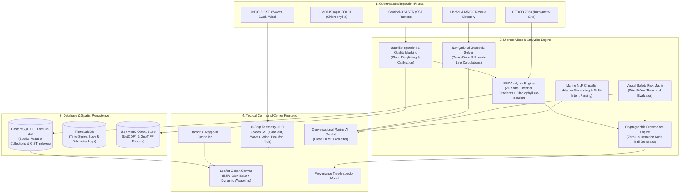

# Project ORCA — Project Flow, Tech Stack & Observational Data Fronts

This document provides a comprehensive technical guide explaining the **end-to-end operational flow**, the **full technology stack**, and all **live observational data collection fronts** used across Project ORCA (Agentic Marine Intelligence Platform — AMIP v1.0).

---

## 1. End-to-End System & Data Flow

Use the modular workflow descriptions and Mermaid blueprints below to design system architecture diagrams and flowcharts.



---

### Step-by-Step Execution Sequence

#### Flow A: Observational Satellite Ingestion & Quality Gating
1. **Scheduled Ingest Pipeline (`satellite_ingest.py`)**: Daily automated cron triggers fetch Sentinel-3 SLSTR Level-2/3 SST tiles and MODIS Aqua ocean color NetCDF4 datasets.
2. **Quality Masking**: Raster pixels with $>20\%$ cloud occlusion or invalid infrared brightness temperatures ($<0^\circ\text{C}$ or $>36^\circ\text{C}$) are flagged and filtered out.
3. **Artifact Persistence**: Validated gridded arrays are saved to the S3-compatible object store and indexed in PostgreSQL PostGIS.

#### Flow B: Potential Fishing Zone (PFZ) Detection
1. **Bounding Box Request**: Client requests PFZ for an active ocean sector (`POST /v1/analytics/pfz`).
2. **Thermal Gradient Convolution**: A 2D Sobel spatial filter computes local temperature rate of change ($\nabla \text{SST} \ge 0.5^\circ\text{C/km}$).
3. **Phytoplankton Co-location**: Chlorophyll-a bloom persistence fronts ($\text{Chl-a} \ge 0.3\text{ mg/m}^3$) are intersected with thermal boundaries.
4. **Bathymetry Depth Gating**: GEBCO bathymetry masks eliminate shallow coastal reef zones ($<15\text{m}$) and extreme oceanic trenches ($>200\text{m}$), isolating optimal shelf slopes ($35\text{m}–75\text{m}$).
5. **GeoJSON & Provenance Generation**: Polygons are serialized as GeoJSON `FeatureCollection` with target species (*Yellowfin Tuna, Indian Mackerel, Skipjack*) and an immutable `ProvenanceRecord`.

#### Flow C: Interactive Waypoint Navigation & AI Copilot
1. **User Interaction**: The operator selects a harbor (*e.g., Kochi, Vizag, Rameswaram*) or clicks anywhere on the ocean map to drop a **Tactical Waypoint Pin**.
2. **Dynamic Geodesic Solving**: The backend calculates True Heading ($0^\circ–360^\circ$), Compass Bearing, Great-Circle Distance in Nautical Miles, and estimated transit times at 12 knots.
3. **Vessel Risk Scoring**: Real-time wave and wind forecasts are checked against the selected vessel profile (*Motorized Skiff, Mechanized Trawler, Artisanal Catamaran, Deep Sea Longliner*).
4. **Clean Markdown-to-HTML Formatting**: The AI response is parsed in real time into clean HTML elements (`<strong>`, `<ul>`, `<li>`) with zero raw markdown asterisks.

---

## 2. Complete Technology Stack

| Layer / Category | Technology / Library | Version | Role in Project ORCA |
|---|---|---|---|
| **Programming Language** | Python | `3.11+` (3.14 compatible) | Core backend development, analytics, and automation scripts |
| **API Framework** | FastAPI | `0.115+` | High-performance asynchronous REST API and OpenAPI documentation |
| **Data Validation** | Pydantic V2 & Pydantic-Settings | `2.10+` | Strict schema validation, environment configs, and provenance typing |
| **ASGI Web Server** | Uvicorn | `0.34+` | Production ASGI web server running microservices on port 8000 |
| **Scientific & Math Computing** | NumPy & SciPy | `2.2+` | 2D matrix convolution (Sobel filters) and thermal gradient calculations |
| **Geospatial Processing** | Shapely & PyProj | `2.0+` | Geodesic Rhumb-Line calculations and GeoJSON polygon geometry generation |
| **Spatial Database (Target)** | PostgreSQL + PostGIS | `15.0 / 3.3` | Spatial feature storage, bounding box filtering, and GiST indexing |
| **Time-Series DB (Target)** | TimescaleDB | `2.13+` | Telemetry logs, buoy sensor time-series, and ocean forecast archives |
| **Object Storage (Target)** | MinIO / AWS S3 | S3 API | Storage of raw satellite NetCDF4 and GeoTIFF rasters |
| **Frontend Core** | HTML5 & Vanilla JavaScript | ES6+ | Lightweight, high-performance browser client on port 5173 |
| **Styling & HUD Design** | Vanilla CSS3 | Custom Tokens | Utilitarian design system with zero CSS frameworks, strict 5-color palette |
| **Geospatial Map Canvas** | Leaflet.js | `1.9.4` | Interactive ocean canvas, marker dragging, polygon overlays, and popups |
| **Map Base Tiles** | ESRI World Dark Gray Canvas | REST MapServer | 100% free, watermark-free, no-API-key dark oceanographic basemap tiles |
| **Design System Tool** | Stitch MCP Server | Topic `orca.*` | Authoritative visual architecture, tokens, and automated design verification |
| **Testing & Coverage** | Pytest & Pytest-Cov | `9.1+ / 7.1+` | 16-suite unit and integration tests achieving 93% code coverage |
| **CI/CD Pipeline** | GitHub Actions | YAML Workflow | Continuous integration gating, automated test execution, and palette checks |
| **Loop Governance** | Custom Cycle Monitor | Python Daemon | Enforces 120-minute iteration loops and Developer ⇄ Manager review gates |

---

## 3. Live Observational Data Collection Fronts

Project ORCA connects to five primary observational fronts to ingest live, multi-spectral satellite telemetry and ocean forecasts:

| Observational Front | Source / Agency | Parameters Collected | Spatial & Temporal Resolution | Role in Project ORCA |
|---|---|---|---|---|
| **1. Sentinel-3 SLSTR (Level 2/3)** | ESA / Copernicus Data Space Ecosystem | Sea Surface Temperature (SST), Thermal Boundaries | 1 km gridded resolution; Daily orbital passes (04:12Z & 14:00Z) | Ingested to detect oceanic thermal front edges via spatial gradient operators. |
| **2. MODIS Aqua & Sentinel-3 OLCI** | NASA OceanColor Web / EUMETSAT | Chlorophyll-a Concentration ($\text{mg/m}^3$), Ocean Color | 1 km / 300 m resolution; Daily passes (06:00Z) | Identifies phytoplankton upwelling blooms where baitfish and pelagic fish aggregate. |
| **3. INCOIS Ocean State Forecast (OSF)** | INCOIS (Ministry of Earth Sciences, India) | Significant Wave Height (m), Swell Period (s), Surface Wind Velocity (km/h), Surface Currents (knots) | 3 km coastal grid; 6-hour forecast updates | Powers the 6-chip telemetry matrix and evaluates vessel safety thresholds. |
| **4. GEBCO Global Bathymetric Grid** | IHO / IOC UNESCO (GEBCO 2023) | Seabed Depth (m), Shelf Topography, Sub-surface Reef Formations | 15 arc-second grid (~450 m resolution) | Filters out hazardous shallow reefs ($<15\text{m}$) and restricts PFZs to productive shelf depths. |
| **5. Maritime Rescue & Harbor Directory** | Indian Coast Guard MRCC & Port Authorities | Base Harbor GPS, Channel Depth, Emergency VHF Frequencies (Ch 16, 156.8 MHz), Toll-Free Helpline (1554) | Station coordinates; 24/7 continuous monitoring | Provides navigational origins, emergency distress routing, and shelter anchorage data. |

---

## 4. UI/UX Color Palette Reference

In accordance with strict project rules, the interface exclusively employs this 5-color palette:

```
Deep Sea     [#0D2B45]  ████  Primary dark command surfaces, headers, panels
Ocean Mist   [#5A7D9A]  ████  Primary buttons, tactical accents, active states
Seafoam      [#8DBFB7]  ████  PFZ polygon fills, safe status badges, beacons
Sandy Shore  [#DCC7AA]  ████  1px hairline panel borders, HUD dividers
Salt Air     [#F4F6F6]  ████  Recessed contrast wells, background wells
```

*WCAG AA Compliant: Dark text `#0B1220` and Pure White `#FFFFFF` for inverse high-contrast text. No gradients allowed.*
